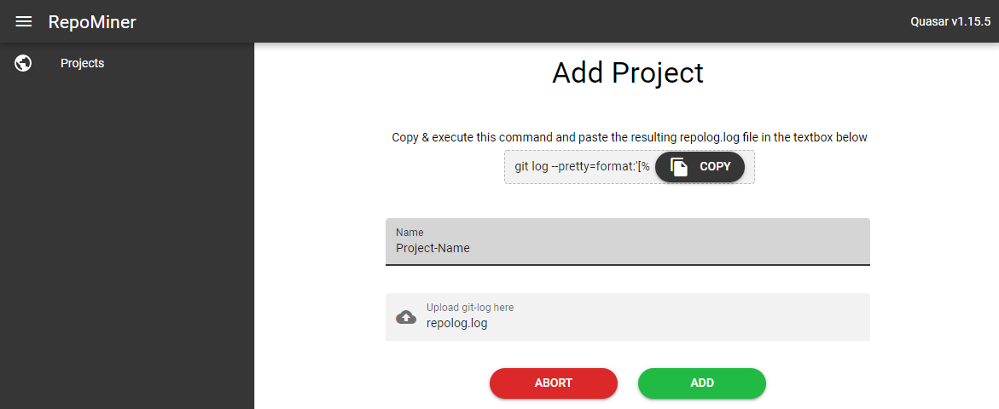

# Hettel-RepositoryMining
> The Hettel-RepositoryMining is a study project from the high school in Kaiserslautern Germany to detect developers
> in a software-project which changed big parts of the code and therefore gained a massive amount of knowledge.
> Such developers are really important for the workflow of the project and if they get sick, there will be no one who can 
> exchange them. These persons are also known as head monopolies.
> 
> The tool works for every git repository. Just navigate to the folder where your git repository is located, open the powershell cli 
> or the win cmd shell and paste the following command into it: 
>``git log --pretty=format:'[%h] [%an] (%p) %ad %s' --date="format:%Y-%m-%d %H:%M:%S" -m --numstat --summary --parents >> repolog.log``
>
> This command creates a new file with the name __repolog.log__ in the current directory and puts all the necessary
> commit information into it. The repolog.log-file is the input for the RepositoryMining-Application.

##Usage
>1. This is how the main menu looks like when you start the application for the first time.
>There are no projects in the database and, you only have the opportunity to add a new project. 
>Now click on the __add project__ button.
>
> 
> 
>2. You'll get navigated to the __add projects__ screen. Here you can copy the necessary git-command for the cli. 
> Execute that command in the directory of the git-repository. A new file with the name __repolog.log__ should appear in the git-repository. 
> Choose a name for your project in the textfield and paste your repolog.log-file in the "Upload git-log here" section. 
> To add the data to the database click on the __add-Button__ otherwise use the __abort-Button__ to go back 
> to the main screen.
> 