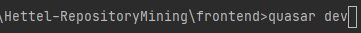
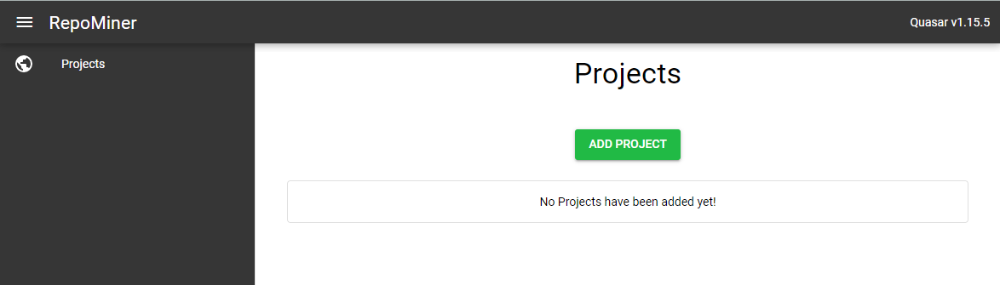
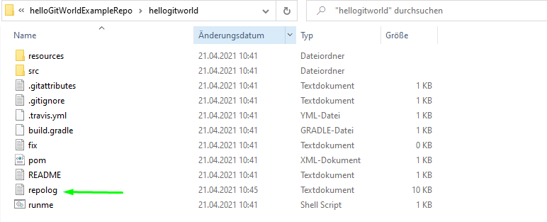
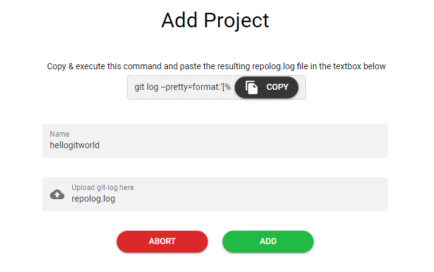
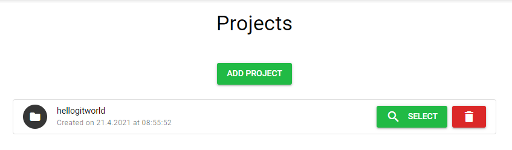
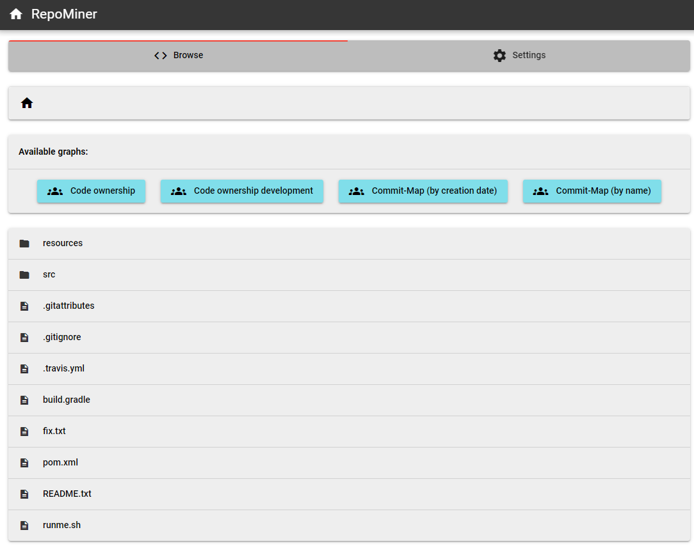
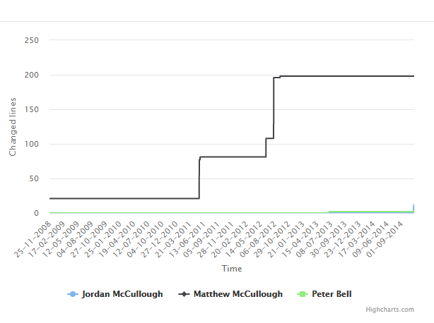
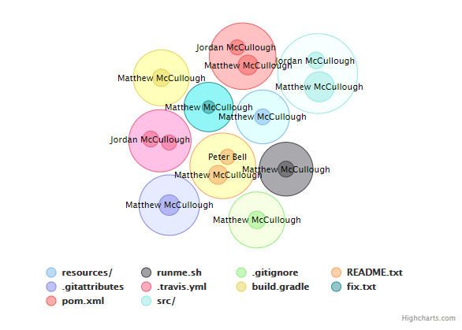
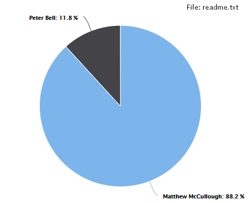
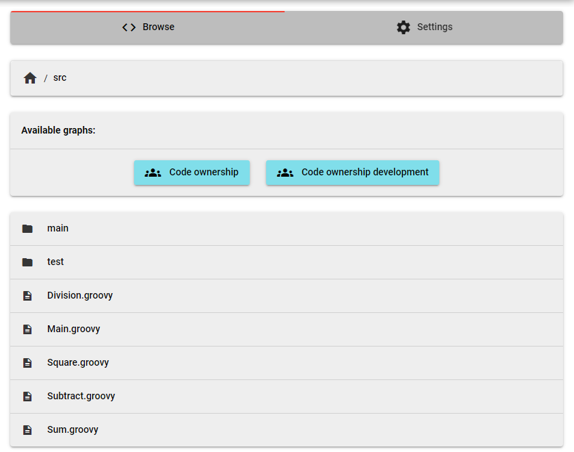

# Hettel-RepositoryMining
> The Hettel-RepositoryMining is a study project from the high school in Kaiserslautern Germany to detect developers
> in a software-project which changed big parts of the code and therefore gained a massive amount of knowledge.
> Such developers are really important for the workflow of the project and if they get sick, there will be no one who can 
> exchange them. These persons are also known as head monopolies.
> 
> The tool works for every git repository. Just navigate to the folder where your git repository is located, open the powershell cli 
> or the win cmd shell and paste the following command into it: 
>``git log --pretty=format:'[%h] [%an] (%p) %ad %s' --date="format:%Y-%m-%d %H:%M:%S" -m --numstat --summary --parents >> repolog.log``
>
> This command creates a new file with the name __repolog.log__ in the current directory and puts all the necessary
> commit information into it. The repolog.log-file is the input for the RepositoryMining-Application.

##Build
>###Frontend
> The frontend was created with the Quasar-Framework. To execute it you have to install the Quasar cli. If you don't
> have it installed yet you can follow the instructions on the quasar-website under the following link:
> [Quasar CLI Installation](https://quasar.dev/quasar-cli/installation)
> To run the frontend in dev-mode navigate to the frontend folder in the Hettel-RepositoryMining Folder and type 
> ``quasar dev`` into the cli.  
> 
> 
> 
> ###Backend
> 

##Usage
>1. This is how the main menu looks like when you start the application for the first time.
>There are no projects in the database and, you only have the opportunity to add a new project. 
>Now click on the __add project__ button.
>
> 
> 
> 2. For this example we use the "hellogitworld" repository on github. You can clone it with the following commands:
> __HTTPS:__ ``https://github.com/githubtraining/hellogitworld.git ``  
> __SSH:__ ``git@github.com:githubtraining/hellogitworld.git``  
> __GitHub CLI:__ ``gh repo clone githubtraining/hellogitworld``  
> After pressing the __add project__ -Button you'll get navigated to the __add projects__ screen. Here you can copy the necessary git-command for the cli. 
> Execute that command in the directory of the git-repository. A new file with the name __repolog.log__ should appear in the git-repository.   
> 
> Choose a name for your project in the textfield and paste your repolog.log-file in the "Upload git-log here" section. 
> To add the data to the database click on the __add-Button__ otherwise use the __abort-Button__ to go back 
> to the main screen.
> 
> 
> 
> 3. After you added the data to the database you'll have now access to them. Click on the red garbage can to delete a 
> project or click on the __select-Button__ to get more details about it. You can also add other projects to the database
> by clicking on the __add project-Button__ (same procedure as in the last 2 steps).
> 
> 
> 
> 4. If you pressed the __select-Button__ you'll be navigated to the __browse-project__-Screen. Here you have a folder 
> structure like the one you had in your repository we cloned before in the 2. step in this tutorial.
> 
>  The __available graphs-Section__ consists of two buttons:
>   - Code ownership development: _shows a line chart with a timeline and the number of changed lines of code
>     by an author at the current path in the directory_
>     

>   - Code ownership: _depends on where you call it up_
>       1. if your current directory has folder in it, the __code ownership__ will display a split packed bubble chart
>          to demonstrate the folders and their content
           
>       2. if the current directory consists of only one file, the __code ownership__ will display a pie chart
>          
> 
> You can click on a single file or folder
> to extend this folder and get deeper in the file-tree structure. For instance clicking on the __src-folder__ in the 
> root directory leads you to the src-folder and the components of it (as you would it expect it)
> 
> Leads you to:
> 
> The header-section on the top of the picture above shows you the current path you are into. You can also change the 
> directory by clicking on the path-components next to the tiny house or go back to the root directory by clicking on 
> the tiny house.