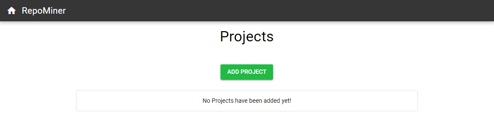
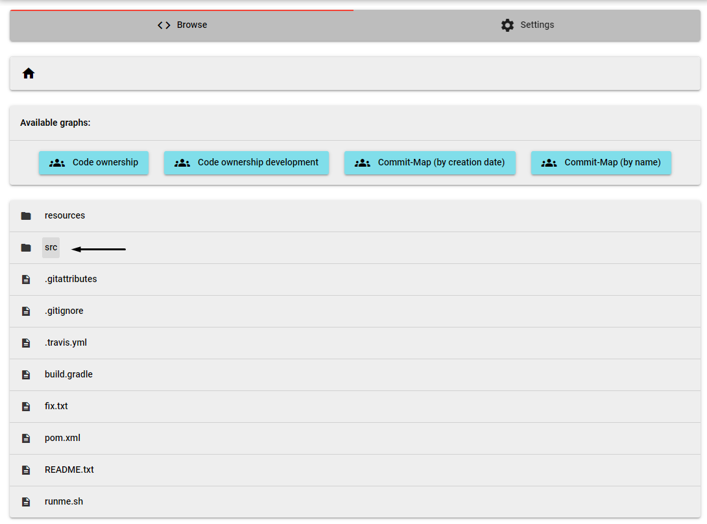
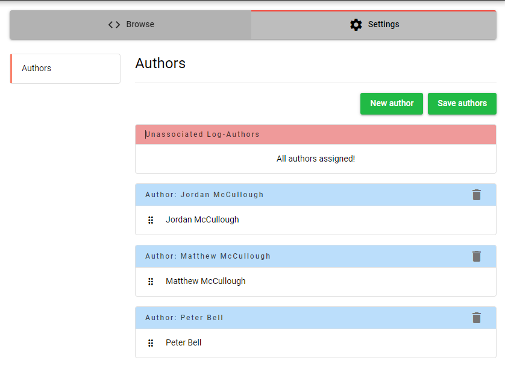
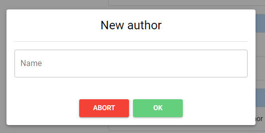

# Hettel-RepositoryMining
> The Hettel-RepositoryMining is a study project from the university of applied sciences 
> in Kaiserslautern Germany to detect developers
> in a software-project which changed big parts of the code and therefore gained a massive amount of knowledge.
> Such developers are really important for the workflow of the project and if they get sick, there will be no one who can 
> exchange them. These persons are also known as head monopolies.
> 
> The tool works for every git repository. Just navigate to the folder where your git repository is located, open the powershell cli 
> or the win cmd shell and paste the following command into it: 
>``git log --pretty=format:'[%h] [%an] (%p) %ad %s' --date="format:%Y-%m-%d %H:%M:%S" -m --numstat --summary --parents >> repolog.log``
>
> This command creates a new file with the name __repolog.log__ in the current directory and puts all the necessary
> commit information into it. The repolog.log-file is the input for the RepositoryMining-Application.

## Build
>### Frontend
> The frontend was created with the Quasar-Framework. To execute it you have to install the Quasar cli. If you
> haven't installed it yet you can follow the instructions on the quasar-website under the following link:
> [Quasar CLI Installation](https://quasar.dev/quasar-cli/installation)
> To run the frontend in dev-mode navigate to the frontend folder in the Hettel-RepositoryMining Folder and type 
> ``quasar dev`` into the cli.  
> 
> 
> 
> ### Backend
> The backend uses the Spring-Framework. To run the backend just clone the repository and import it as an existing maven repository into your IDE.
> After that move to the __src/main/java__ folder and click on the __de.hskl.repominer__ package. Now open the __RepoMiner.java__
> file and run it. 
> 
> ### Build for production
> To perform the maven build  just navigate to the __Hettel-RepositoryMining__-folder and open
> the powershell/cli. Type ``mvn clean install`` and run the command. 
> 
> 

## Usage
>1. This is how the main menu looks like when you start the application for the first time.
>There are no projects in the database, you only have the opportunity to add a new project. 
>Now click on the __add project - Button__ .
>
> 
> 
> 2. For this example we use the "hellogitworld" repository on github. You can clone it with the following commands:  
> __HTTPS:__ ``https://github.com/githubtraining/hellogitworld.git ``  
> __SSH:__ ``git@github.com:githubtraining/hellogitworld.git``  
> __GitHub CLI:__ ``gh repo clone githubtraining/hellogitworld``  
> After pressing the __add project__ -Button you'll get navigated to the __add projects__ screen. Here you can copy the necessary git-command for the cli. 
> Execute that command in the directory of the git-repository. A new file with the name __repolog.log__ should appear in the git-repository.   
> 
> Choose a name for your project in the textfield and paste your repolog.log-file in the "Upload git-log here" section. 
> To add the data to the database click on the __add-Button__ otherwise use the __abort-Button__ to go back 
> to the main screen.
> 
> 
> 
> 3. After you added the data to the database you'll have now access to them. Click on the red garbage can to delete a 
> project or click on the __select-Button__ to get more details about it. You can also add other projects to the database
> by clicking on the __add project-Button__ (same procedure as in the last 2 steps).
> 
> 
> 
> 4. If you pressed the __select-Button__ you'll be navigated to the __browse-project__-Screen. Here you have a folder 
> structure like the one you had in your repository we cloned before in the 2. step in this tutorial. There is also a 
> settings section where you can change your properties. 
> 
>  The __available graphs-Section__ consists of two buttons:
>   - Code ownership development: _shows a line chart with a timeline and the number of changed lines of code
>     by an author at the current path in the directory_
>     

>   - Code ownership: _depends on where you call it up_
>       1. if your current directory has folder in it, the __code ownership__ will display a split packed bubble chart
>          to demonstrate the folders and their content
           
>       2. if the current directory consists of only one file, the __code ownership__ will display a pie chart
>            
> __Information:__ if one of these graphs display to much information you can simply 
> disable or enable single parts of the graph by clicking on the components name. For example in the pictures above
> you can disable/enable the graph content by clicking on the author-name (Matthew McCullough) or the folder/file-name
> (resource/, README.txt).  
> 
> You can click on a single file or folder
> to extend this folder and get deeper in the file-tree structure. For instance clicking on the __src-folder__ in the 
> root directory leads you to the src-folder and the components of it (as you would it expect it)  
>  
> Leads you to:  
>   
> The header-section on the top of the picture above shows you the current path you are into. You can also change the 
> directory by clicking on the path-components next to the tiny house or go back to the root directory by clicking on 
> the tiny house.
> 
> 5. To get to the settings just click on the __Settings-Button__ on the top of the page. You are now
> in the "Authors"-settings.  
> 
> Here you can drag the different log-authors from one author group to another author group or create new authors and link a group of log-authors
> to them. Every log-author who is in an author group is treated as one author and will be displayed in the graph visualizations.
> With the small garbage can on the right site of every author group you can delete the
> specific author.  
>   
> In the picture above you can see that we draged the log-author "Matthew McCullough" into the author group of
> Jordan McCullough. After saving the author settings by clicking on the __Save authors-Button__, commits of one 
> of those two log-authors  get treated as they 
> were __both__ "Jordan McCullough".  
> Clicking on __new author__ leads you to this dialog:
>   
> Here you can type in the name for your new author and confirm it with the green __OK-Button__. To exit the dialog without 
> creating a new author just click the __ABORT-Button__.
